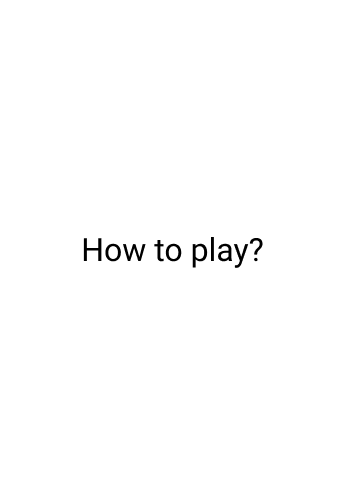

# Battle Board (client)

## How to play

<p style="text-align: center;">
  
</p>

Project url: [https://battle-board.dimaslz.dev/](https://battle-board.dimaslz.dev/)

## Motivation

This simple game it's just for fun !. One of my restlessness was to use SocketIO and NestJS framework to make a simple API. Meanwhile, I was thinking of some ideas to implement and increase the playability and more.

## TODO

- [ ] Add unit tests (I start it just prototyping, now I think is something that could be good to keep safe)
- [ ] Improve board UI
- [ ] Improve count down synchronization
- [ ] Cached your data, playerID and always have the same
- [ ] Maybe can create an account? (send me an issue if you like the idea)
- [ ] Improve feedback with the user
- [ ] Port to mobile app
- [ ] ...

## Project setup

```
yarn install
```

### Compiles and hot-reloads for development

```
yarn serve
```

### Compiles and minifies for production

```
yarn build
```

### Run your unit tests

```
yarn test:unit
```

### Run your end-to-end tests

```
yarn test:e2e
```

### Lints and fixes files

```
yarn lint
```

### Customize configuration

See [Configuration Reference](https://cli.vuejs.org/config/).

## License

Copyright (c) Dimas López (dimaslz). All rights reserved.

Licensed under the [MIT](LICENSE.txt) license.
